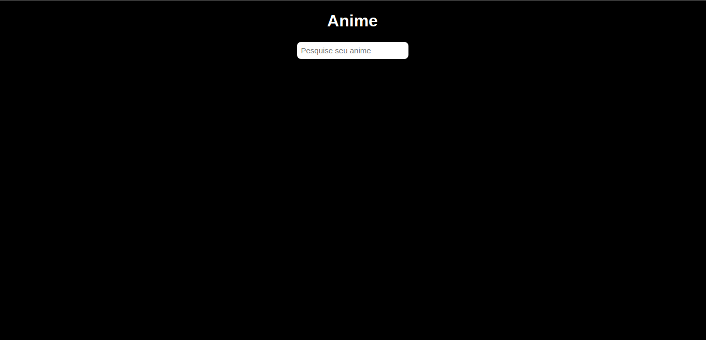
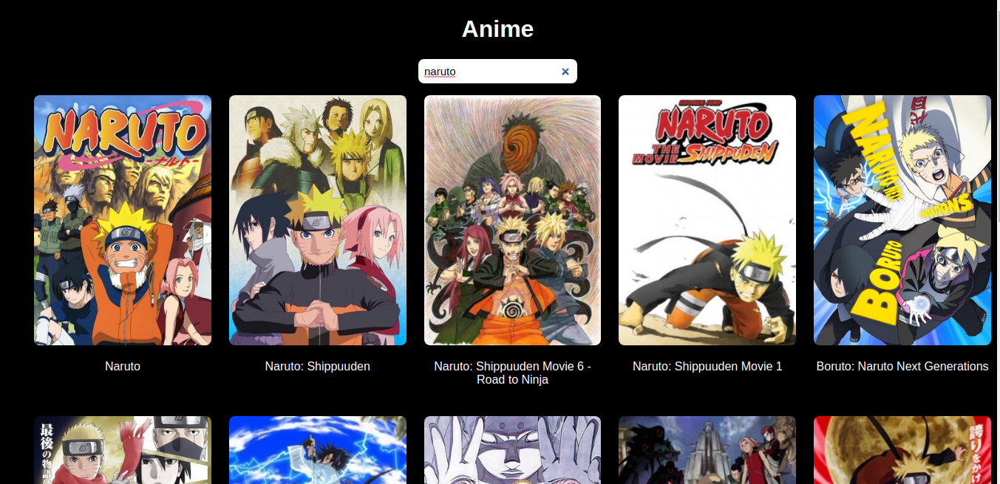

Esse projeto tem como proposito de realizar pesquisa de seus `Animes` preferidos, utilizando o React e Fetch ara conumir `APi` de animes

Espero que gostem

Você deseja ter esse repositorio na sua maquina siga esses passos: 

1 - `git clone https://github.com/joaopaulo-D/react-animes.git
2 - `npm install ou npm i`
3 - `npm start ou yarn start` 

# Home

# Resultado

 
 

### Projeto Desenvolvido por `João Paulo`
